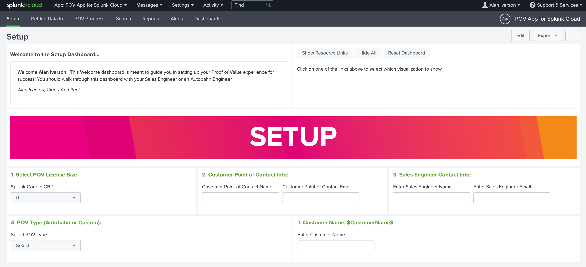
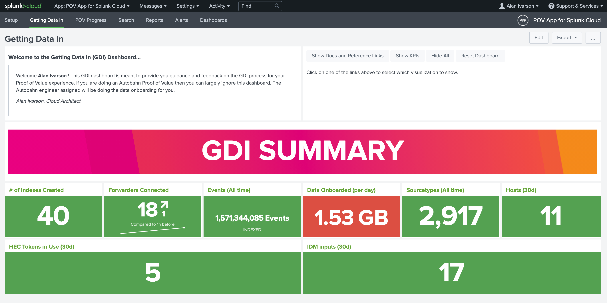
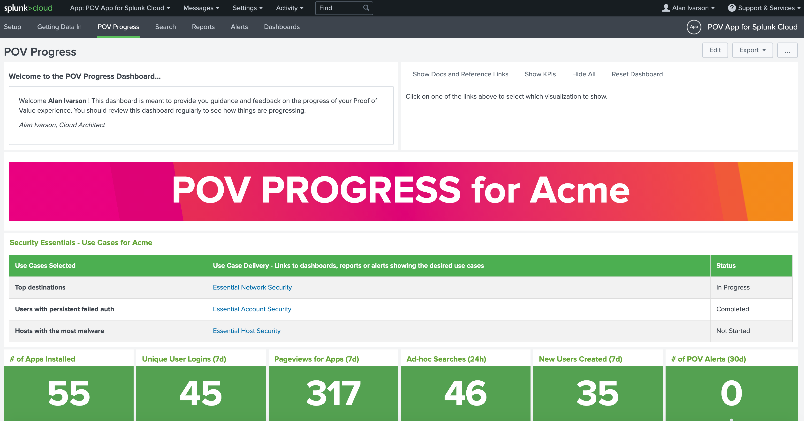

# POV App for Splunk Cloud

## Introduction
The purpose of the **POV App for Splunk Cloud** is to provide insights about your POV experience in Splunk Cloud. There are 3 dashboards included in this app along with alerts to guide you toward a successful POV experience.

**Setup Dashboard** - This dashboard provides information on the purpose of the app and collects data about the desired outcomes of the POV.

**Getting Data In Dashboard** - This dashboard provides KPIs, charts and graphs for all things related to getting data in. 

**POV Progress Dashboard** - This dashboard shows the progress against the use cases that were selected in the setup dashboard. This dashboard also highlights usage and engagement during the POV. This dashboard should be used for weekly check-ins and reviewing the progress of the POV.

## Installation instructions

This app is a self service installable Splunk Cloud app. Follow the instructions in our documentation to install the app in your Splunk Cloud instance. [Splunk Cloud private app install documentation](https://docs.splunk.com/Documentation/SplunkCloud/latest/DevApp/Deployingtheapp#Upload_the_private_app_to_Splunk_Cloud)

(optional) - Configure alerts in app to send to email. Alerts are included in the KPIs for the POV Progress Dashboard. However, if you want them to come to your email you can configure this like you would any other alert.

## Dashboards References

Sample view of the Setup Dashboard. [POV App 4 Splunk Cloud - Setup Dashboard (setup.xml)](default/data/ui/views/setup.xml)

Sample view of the Getting Data In Dashboard. [POV App 4 Splunk Cloud - Getting Data In Dashboard (gdi.xml)](default/data/ui/views/gdi.xml)

Sample view of the POV Progress Dashboard. [POV App 4 Splunk Cloud - POV Progress Dashboard (povprogress.xml)](default/data/ui/views/povprogress.xml)

**Tip:** 
Take screenshots during the weekly check-ins to capture the progress of your POV over time. These can be use during the wrap up presentation, in addition to the dashboards that will show the current state.

